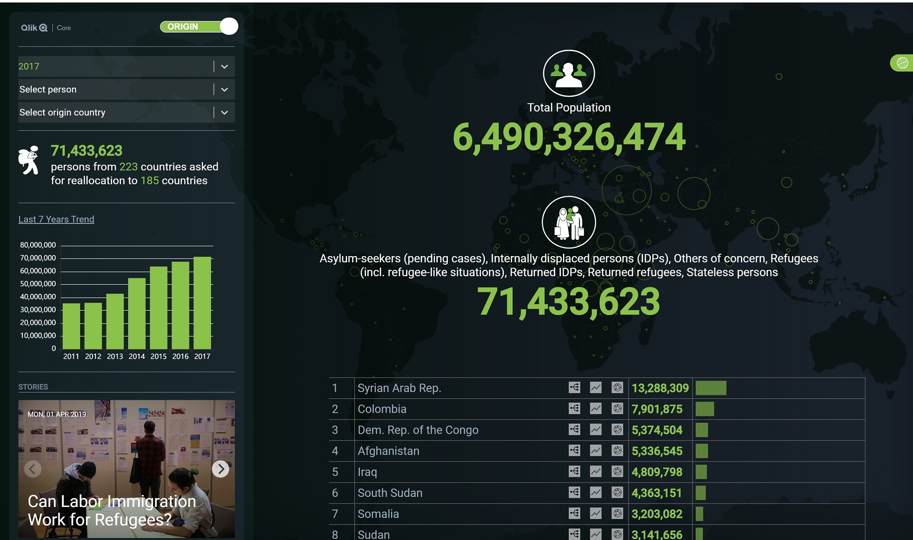
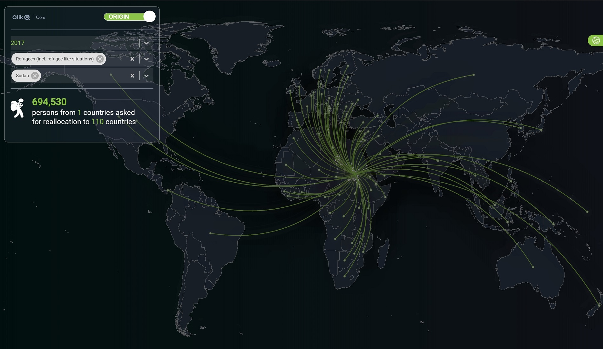

# The Project

The Qlik Core Refugee Project is an open source learning project, which was created by using Qlik Core, React and Docker Container. The journey started at the Qlik Master Summit 2019 in Sweden during the hackathon with the goal to provide a valuable user experience using the Qlik Core Associative Engine and open source visualization libraries to provide insights to the refugees and migration topic around the world. 




## Qlik Core Installation

* Download and run Qlik Core in a container using for instance Docker Desktop for Windows https://hub.docker.com/r/qlikcore/engine/tags 
* Pull the latest Qlik Core version 
  ``` 
  $ docker run -d qlikcore/engine:$LAST_VERSION
  ```
* Run Core (you MUST accept the EULA) 
  ```
  $ docker run -d qlikcore/engine:$LAST_VERSION -S AcceptEULA=yes 
  ```
* Run shell in the container 
  ```
  $ docker exec -it <id-prefix> /bin/s
  ```
## Run Webapp

* Install dependencies:
  ```bash
  npm install
  ```
* Start the Qlik Associative Engine in a Docker container by accepting the EULA license:
  ```bash
  docker-compose up -d
  ```
* Run the application:
  ```bash
  npm start
  ```
* Open a browser and navigate to [http://localhost:3000](http://localhost:3000) to view the webapp.

## Qlik and Data files
The data folder is containing the .qvf file including the data used for the project provided by the Qlik Master Summit team

## Credits
* UI Web Design template
    - Ekene Ijeoma
    - Hyperakt

## Authors
* Patric Amatulli 
* Alexander Torngren
